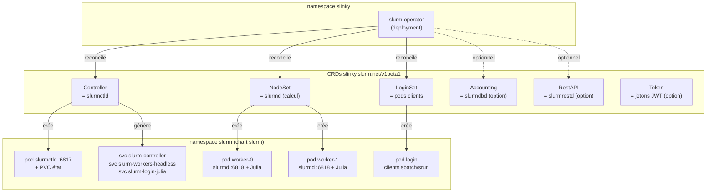
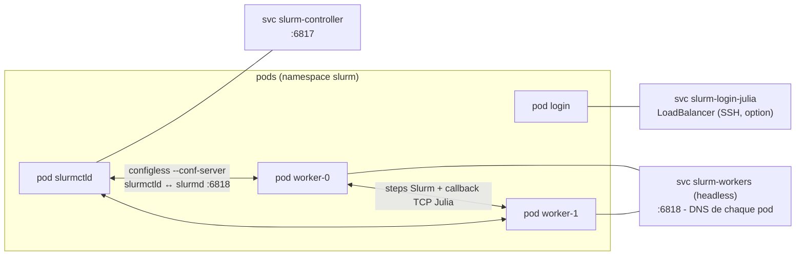
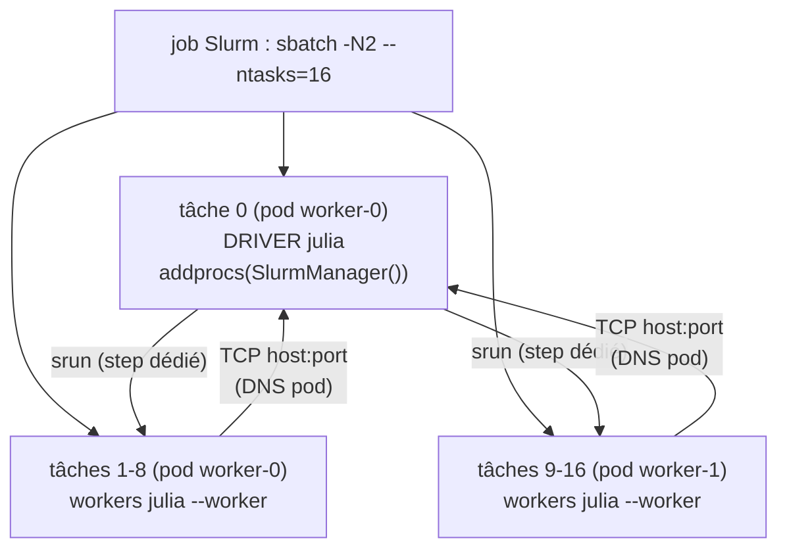
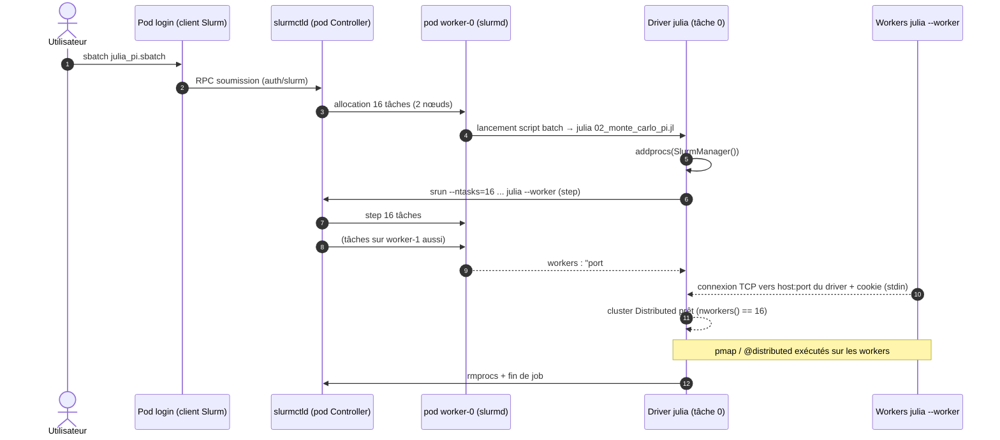

# 01 - Architecture

← [README](../README.md) | [02 - Prérequis →](02-prerequis-installation.md)

Ce chapitre décrit comment Slinky compose un cluster Slurm dans Kubernetes et
où se place Julia dans ce modèle.

## 1. Les pièces de Slinky

L'opérateur (`slurm-operator`, namespace `slinky`) surveille six CRDs
(`slinky.slurm.net/v1beta1`) et matérialise les charges dans le namespace du
cluster Slurm (`slurm` dans ce dépôt). Il n'existe **pas** de CRD
`SlurmCluster` monolithique.

Points clés :

- **Configless** : chaque `slurmd` récupère sa configuration directement auprès
  de `slurmctld` (`--conf-server`) - pas de `slurm.conf` partagé, pas de NFS.
- **Authentification `auth/slurm`** : clé partagée `slurm.key` dans un Secret,
  distribuée aux pods. **Pas de MUNGE.** Un `jwt.key` séparé sert au REST.
- **Scaling** d'un NodeSet : `StatefulSet` (replicas fixes, noms stables -
  retenu ici) ou `DaemonSet` (un pod par nœud éligible).

## 2. Réseau et services

Slinky crée un **headless service unique pour tous les workers du cluster**
(`slurm-workers-<controller>`) : les pods y adhèrent, leurs noms d'hôtes
Slurm sont résolus par le DNS Kubernetes. C'est ce qui permet le **callback
TCP des workers Julia** vers le driver (§4).

| Port | Usage |
|---|---|
| 6817 | `slurmctld` (ordonnanceur) |
| 6818 | `slurmd` (démon de calcul) |
| 6820 | `slurmrestd` (si RestAPI déployée) |

## 3. Où vit le driver Julia ?

`SlurmClusterManager.jl` impose un contrat strict : `SlurmManager()` est
construit **dans une allocation Slurm existante** (`SLURM_JOB_ID` et
`SLURM_NTASKS` requis). Le driver Julia est donc **la tâche 0 d'un job**,
exécutée dans un pod de calcul - jamais un pod « libre » du cluster.

## 4. Flux complet d'un job Julia

Détails du mécanisme `addprocs` : [05 - Julia Distributed](05-julia-distributed-slurm.md).

## 5. Limites du modèle (à connaître)

- **Pas de filesystem partagé** par défaut : le code et l'environnement Julia
  vivent **dans l'image** (voir [04](04-images-conteneurs.md)) ; les données
  massives exigent un volume réseau (PVC RWX, NFS…) monté sur les NodeSets.
- **Sortie sbatch locale** : `--output=/tmp/slurm-%j.out` atterrit sur le pod
  de calcul ; récupération par `kubectl exec` (voir
  [06 - Soumission de jobs](06-soumission-jobs.md)).
- **1 pod = 1 nœud Slurm** : les jobs utilisent les CPU/RAM demandés dans les
  `resources` du NodeSet ; surveillez les requests/limits.

→ Suivant : [02 - Prérequis & installation](02-prerequis-installation.md)
