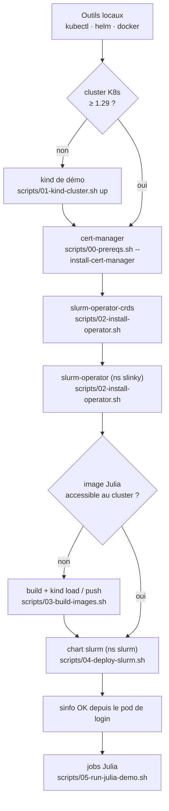

# 02 - Prérequis & installation

← [01 - Architecture](01-architecture.md) | [03 - Déploiement du cluster Slurm →](03-deploiement-slurm.md)

## 1. Matrice de dépendances

| Composant | Version minimale | Rôle | Obligatoire |
|---|---|---|---|
| Kubernetes | **≥ 1.29** (`kubeVersion` du chart `slurm`) | orchestration | oui |
| cert-manager | dernière stable | certificats webhook de l'opérateur | oui* |
| Helm | ≥ 3.14 (OCI charts) | installation des charts | oui |
| kubectl | ≥ 1.29 | pilotage du cluster | oui |
| Docker/Podman | récent | construction de l'image Julia | pour builder |
| kind | ≥ 0.22 | démo locale uniquement | non |
| Prometheus | kube-prometheus-stack | métriques slurmctld / GPU DCGM | non |

\* désactivable avec `--set certManager.enabled=false` (certificats auto-signés
générés par Helm) - non recommandé en production.

Architectures supportées par les images Slinky : **amd64** et **arm64**.

## 2. Ordre d'installation



## 3. Commandes de référence (équivalent scripts/)

### 3.1 cert-manager

```bash
helm install cert-manager oci://quay.io/jetstack/charts/cert-manager \
  --namespace cert-manager --create-namespace \
  --set crds.enabled=true
```

### 3.2 Prometheus (optionnel, AVANT le chart slurm)

```bash
helm repo add prometheus-community https://prometheus-community.github.io/helm-charts
helm repo update
helm install prometheus prometheus-community/kube-prometheus-stack \
  --namespace prometheus --create-namespace
# puis activer sur le chart slurm :
#   --set controller.metrics.enabled=true
#   --set controller.metrics.serviceMonitor.enabled=true
```

### 3.3 Opérateur

```bash
# CRDs d'abord (portée cluster, sans namespace)
helm install slurm-operator-crds oci://ghcr.io/slinkyproject/charts/slurm-operator-crds

# Opérateur dans un namespace dédié
helm install slurm-operator oci://ghcr.io/slinkyproject/charts/slurm-operator \
  --namespace=slinky --create-namespace
```

Alternative : CRDs en sous-chart (`--set crds.enabled=true` sur
`slurm-operator`). Les deux modes ne doivent **jamais** coexister.

## 4. Dimensionnement minimal (démo)

| Ressource | Recommandation démo |
|---|---|
| Nœuds K8s | 3 (1 control-plane + 2-3 workers en kind) |
| CPU par nœud worker | ≥ 4 |
| RAM par nœud worker | ≥ 8 Gi (depot Julia précompilé ≈ 1 Gi d'image) |
| Stockage | StorageClass par défaut (PVC 4 Gi pour slurmctld) |

## 5. Vérifications post-prérequis

```bash
kubectl version                      # serveur ≥ 1.29
kubectl get crds | grep slinky.slurm.net   # 6 CRDs présentes après 02
kubectl -n slinky get pods           # opérateur Running 1/1
```

→ Suivant : [03 - Déploiement du cluster Slurm](03-deploiement-slurm.md)
