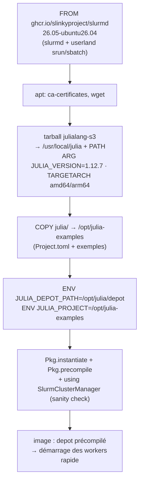
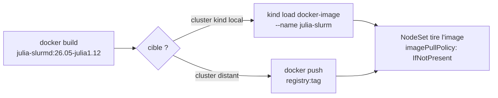

# 04 - Images conteneurs

← [03 - Déploiement du cluster Slurm](03-deploiement-slurm.md) | [05 - Julia Distributed sur Slurm →](05-julia-distributed-slurm.md)

## 1. Catalogue des images Slinky

| Composant | Image (ghcr.io/slinkyproject/…) | Déployée par |
|---|---|---|
| slurmctld | `slurmctld:26.05-ubuntu26.04` | chart slurm (Controller) |
| slurmd | `slurmd:26.05-ubuntu26.04` | chart slurm (NodeSet) - **remplacée par la nôtre** |
| slurmdbd | `slurmdbd:26.05-ubuntu26.04` | chart slurm (Accounting, option) |
| slurmrestd | `slurmrestd:26.05-ubuntu26.04` | chart slurm (RestAPI, option) |
| login | `login:26.05-ubuntu26.04` | chart slurm (LoginSet) |

Pourquoi customiser **slurmd** uniquement ? Les steps Slurm s'exécutent
*dans* les pods slurmd : le driver Julia et ses workers ont besoin de
`julia`, du projet et du depot - pas slurmctld ni le login.

## 2. L'image `julia-slurmd`

Source : [`docker/julia-slurm/Dockerfile`](../docker/julia-slurm/Dockerfile)



Pourquoi « cuire » le depot dans l'image :

1. `SlurmClusterManager` propage `JULIA_PROJECT` / `JULIA_DEPOT_PATH` du
   driver vers les workers - mêmes chemins dans la même image → zéro
   configuration, zéro NFS.
2. La précompilation au build évite N workers × compilation au premier job.
3. Le depot image-local est immuable en exécution → pods éphémères sûrs.

> ⚠ Les scripts `sbatch` ne sont **pas** embarqués : ils sont lus côté client
> (pod de login) au moment de la soumission - voir [06](06-soumission-jobs.md).

## 3. Construction et distribution

```bash
./scripts/03-build-images.sh
# équivalent :
docker build -f docker/julia-slurm/Dockerfile \
  --build-arg JULIA_VERSION=1.12.7 \
  -t julia-slurmd:26.05-julia1.12 .
```



- **kind** : `kind load docker-image` est automatique quand le cluster kind
  existe (`scripts/03-build-images.sh`). Tag local = pas de registry requis.
- **cluster distant** : `PUSH=1 ./scripts/03-build-images.sh` puis, si le
  registry est privé, configurez le pull secret côté cluster (ServiceAccount
  du namespace `slurm`).
- **Production** : épinglez l'image par **digest** (`digest:` est accepté par
  les values Slinky) et le SHA256 du tarball Julia dans le Dockerfile.

## 4. Variantes

| Besoin | Piste |
|---|---|
| CUDA / GPU Julia (CUDA.jl) | image base slurmd `nvidia` variant ou runtime nvidia + `configFiles.gres.conf: AutoDetect=nvidia` + `resources.limits: nvidia.com/gpu` sur le NodeSet |
|Packages privés | ajoutez un `AuthCLone`/registre local dans `Pkg` au build, ou montez un depot en PVC RWX |
| reproductibilité stricte | figez `Project.toml` + `Manifest.toml` (enlevez `Manifest.toml` du `.dockerignore`) et rebuilt régulier pour les patchs sécurité |

## 5. Vérifier l'image avant déploiement

```bash
docker run --rm julia-slurmd:26.05-julia1.12 \
  julia --project=/opt/julia-examples -e \
  'using SlurmClusterManager, Distributed; println("image OK")'
```

→ Suivant : [05 - Julia Distributed sur Slurm](05-julia-distributed-slurm.md)
