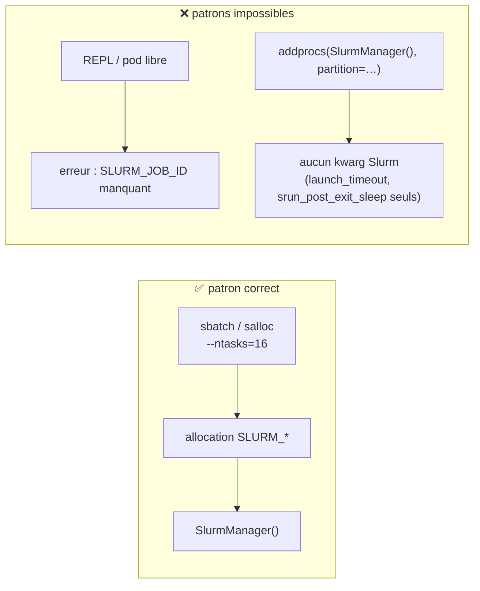
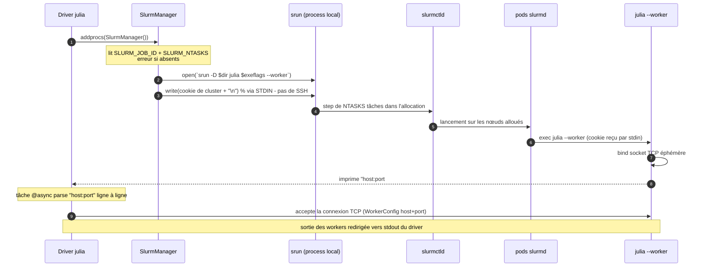
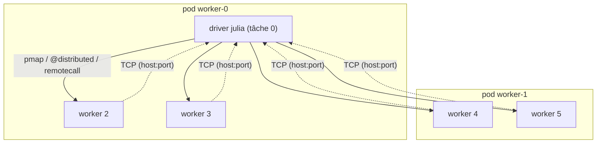

# 05 - Julia Distributed sur Slurm

← [04 - Images conteneurs](04-images-conteneurs.md) | [06 - Soumission de jobs →](06-soumission-jobs.md)

Ce chapitre est le cœur du dépôt : le contrat exact de
[`SlurmClusterManager.jl` v1.1.0](https://github.com/JuliaParallel/SlurmClusterManager.jl)
et son fonctionnement sur Slinky.

## 1. Le contrat d'allocation

`SlurmManager()` est **le seul constructeur** et il n'accepte **aucun argument
Slurm** (pas de `partition`, `ntasks`, `gres`…). Il exige au moment de sa
construction :

| Variable d'environnement | Rôle | Sinon |
|---|---|---|
| `SLURM_JOB_ID` (ou legacy `SLURM_JOBID`) | identifie l'allocation courante | **erreur** |
| `SLURM_NTASKS` | nombre de workers à attendre | **erreur** |

Conséquence architecturale : le driver Julia est **lancé par sbatch/salloc**
(voir [06](06-soumission-jobs.md)). Toute la topologie (partition, tâches,
CPU, mémoire, GPU) est décidée **par l'allocation**, jamais par Julia.

Les kwargs supportés par `addprocs(SlurmManager(); …)` :

| Kwarg | Défaut | Effet |
|---|---|---|
| `launch_timeout` | `60.0` s | délai max d'attente des connexions workers (mettre 300 en conteneur) |
| `srun_post_exit_sleep` | `0.01` s | pause après sortie de srun (laisser Slurm enregistrer l'exit) |
| `dir` | `pwd()` | répertoire de travail passé à `srun -D` |
| `exename` | `Sys.BINDIR/julia` | binaire Julia des workers |
| `exeflags` | - | drapeaux ajoutés aux workers (ex. `--threads=N`) |
| `env` | - | variables ajoutées aux workers (Julia ≥ 1.6) |

Propagation automatique driver → workers : **`JULIA_PROJECT`**,
**`JULIA_LOAD_PATH`**, **`JULIA_DEPOT_PATH`** (via `addenv` sur srun).

## 2. Mécanisme interne

Sur Slinky, `host` imprimé par le worker est le hostname du pod (`worker-0`,
`worker-1`…) - résolvable grâce au headless service
`slurm-workers-<controller>` (voir [01 §2](01-architecture.md)). Aucun port à
exposer manuellement : sockets **éphémères**, connexions **pod → pod**.

## 3. Topologie obtenue

## 4. Différence avec l'ancien `ClusterManagers.jl`

| Aspect | `ClusterManagers.SlurmManager` (déprécié) | `SlurmClusterManager.SlurmManager` (ce dépôt) |
|---|---|---|
| Soumission d'un job | possible depuis un nœud de login | **interdit** : doit être dans une allocation |
| Kwarg `np` / flags Slurm | oui | **non** |
| Découverte des workers | fichiers `.out` sur disque | stdout de srun (stream) |
| Sortie workers | fichiers par tâche | redirigée vers le driver |
| Auth worker | SSH ou cookie en arg | cookie par **stdin**, pas de SSH |

`ClusterManagers.jl` émet un `depwarn` renvoyant explicitement vers ce package.

## 5. Bonnes pratiques sur Slinky

1. **`launch_timeout=300.0`** : le premier `srun` d'une image fraîchement
   déployée peut être lent (pull image, cold start).
2. **Threads vs tâches** : `--cpus-per-task=2` à l'allocation +
   `exeflags="--threads=2"` côté workers ; ne doublez pas les deux.
3. **Projet actif** : lancez toujours `julia --project=/opt/julia-examples`
   (ou `JULIA_PROJECT` env) pour que la propagation couvre les workers.
4. **Données volumineuses** : partagez par volume RWX monté sur le NodeSet
   (`slurmd.volumeMounts`), pas par le depot image.
5. **Arrêt propre** : `rmprocs(workers(); waitfor=60)` avant la fin du script
   - évite les steps orphelins et les « Waiting up to 32 seconds ».
6. **Vérifiez l'environnement** : `julia/04_options_demo.jl` imprime les
   variables `SLURM_*` héritées et teste la propagation du project.

→ Suivant : [06 - Soumission de jobs](06-soumission-jobs.md)
