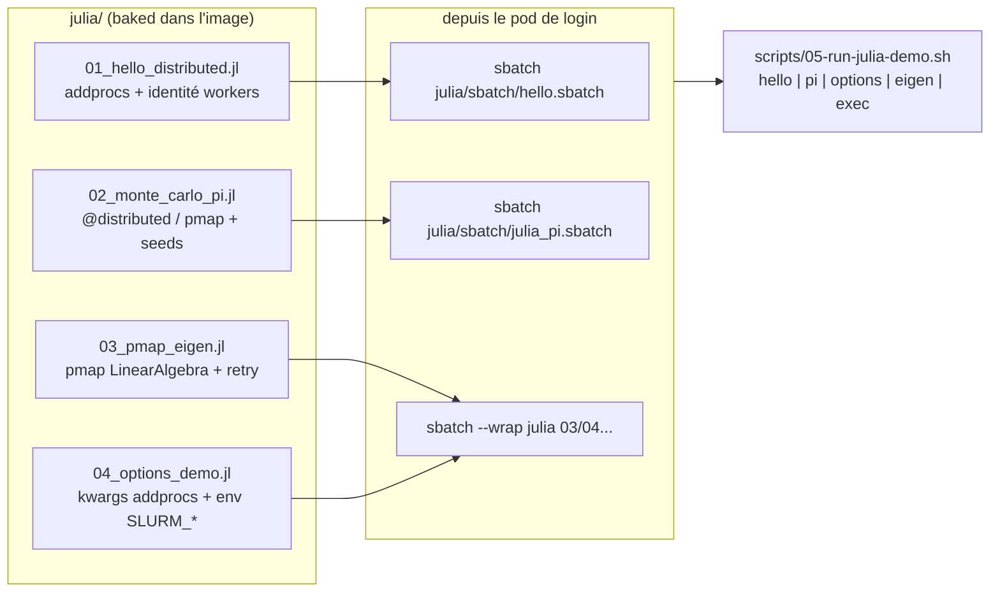

# 07 - Exemples bout-en-bout

← [06 - Soumission de jobs](06-soumission-jobs.md) | [08 - Troubleshooting →](08-troubleshooting.md)

Les quatre scripts de [`julia/`](../julia/) s'exécutent **dans une allocation
Slurm** sur les pods NodeSet (image `julia-slurmd`). Chemins dans le pod :
`/opt/julia-examples` (projet), depot précompilé à `/opt/julia/depot`.

## 1. Vue d'ensemble



## 2. `hello` - addprocs minimal

```bash
./scripts/05-run-julia-demo.sh hello
# équivalent manuel :
kubectl cp julia/sbatch/hello.sbatch <login>:/tmp/hello.sbatch
kubectl exec <login> -- sbatch /tmp/hello.sbatch
kubectl exec <worker-pod> -- cat /tmp/slurm-<JOBID>.out
```

Sortie attendue (extrait) :

```
[ Info: Allocation Slurm détectée (jobid=…, ntasks=4, hostname=worker-0)
[ Info: Lancement des workers via srun…
bonjour depuis worker 2 @ worker-0 (threads=1)
bonjour depuis worker 3 @ worker-0 (threads=1)
bonjour depuis worker 4 @ worker-1 (threads=1)
bonjour depuis worker 5 @ worker-1 (threads=1)
somme 1..1_000_000 vérifiée sur 4 workers : OK (500000500000)
[ Info: Terminé.
```

Ce qu'on vérifie : `SLURM_JOB_ID`/`SLURM_NTASKS` lus, `srun` lance les 4
workers répartis sur les 2 pods, callback TCP OK, sortie agrégée sur le
stdout du driver.

## 3. `pi` - Monte-Carlo parallèle

```bash
PI_SAMPLES=1000000000 ./scripts/05-run-julia-demo.sh pi
```

Sortie attendue :

```
π ≈ 3.14159265  (erreur absolue ~1e-3 ou moins)
1_000_000_000 échantillons × 128 morceaux sur 16 workers en ~2-6 s
OK - π estimé à moins de 1e-3 près.
```

Points techniques : découpage en `8 × nworkers()` morceaux (équilibrage),
`Xoshiro` seedé par `(jobid, chunk)` → résultat **reproductible** quel que
soit l'ordonnancement, `pmap` avec détection d'erreur immédiate.

## 4. `eigen` - pmap + LinearAlgebra + reprise

```bash
N_MATRICES=512 ./scripts/05-run-julia-demo.sh eigen
```

Sortie attendue :

```
normes spectrales calculées : 512 matrices 512x512 en ~8-20 s
moyenne=…  min=…  max=…
temps séquentiel équivalent ≈ … s → speedup ≈ 10-15x sur 16 workers
```

Points techniques : `retry_delays=ones(3)` → 3 tentatives espacées d'1 s en
cas de mort d'un worker (le nombre de tentatives = `length(retry_delays)` ;
`pmap` n'a **pas** de kwarg `retry_n`), `on_error=rethrow` (fail-fast après
les tentatives), estimation du speedup par un lot séquentiel de référence.

## 5. `options` - kwargs et environnement

```bash
./scripts/05-run-julia-demo.sh options
```

Sortie attendue (extrait) :

```
== Environnement Slurm hérité par le driver ==
  SLURM_JOB_ID = 12
  SLURM_NTASKS = 8
  SLURM_JOB_NUM_NODES = 2
  SLURM_CPUS_PER_TASK = 2
  SLURM_JOB_PARTITION = all
  SLURM_NODELIST = worker-[0-1]
worker 2 : host=worker-0  threads=2  dir=/tmp
...
JULIA_PROJECT identique driver/worker : /opt/julia-examples/Project.toml  ✓
```

## 6. Interactif - exploratoire

```bash
./scripts/05-run-julia-demo.sh exec     # shell dans le pod de login
salloc -N 2 --ntasks=16 bash
julia --project=/opt/julia-examples
julia> using Distributed, SlurmClusterManager
julia> addprocs(SlurmManager(; launch_timeout=300.0))
julia> @everywhere println(myid(), " @ ", gethostname())
julia> exit(); exit                    # libère l'allocation
```

## 7. Dépannage rapide des exemples

| Symptôme | Chapitre |
|---|---|
| `SLURM_JOB_ID manquant` au lancement | [05 §1](05-julia-distributed-slurm.md) - le script a été lancé hors allocation |
| `launch_timeout` dépassé | [08 §3](08-troubleshooting.md) - callback TCP bloqué |
| sortie `slurm-<JOBID>.out` introuvable | [06 §2](06-soumission-jobs.md) - mauvais pod de calcul interrogé |
| workers lents au premier job | [04 §2](04-images-conteneurs.md) - depot non précompilé |

→ Suivant : [08 - Troubleshooting](08-troubleshooting.md)
