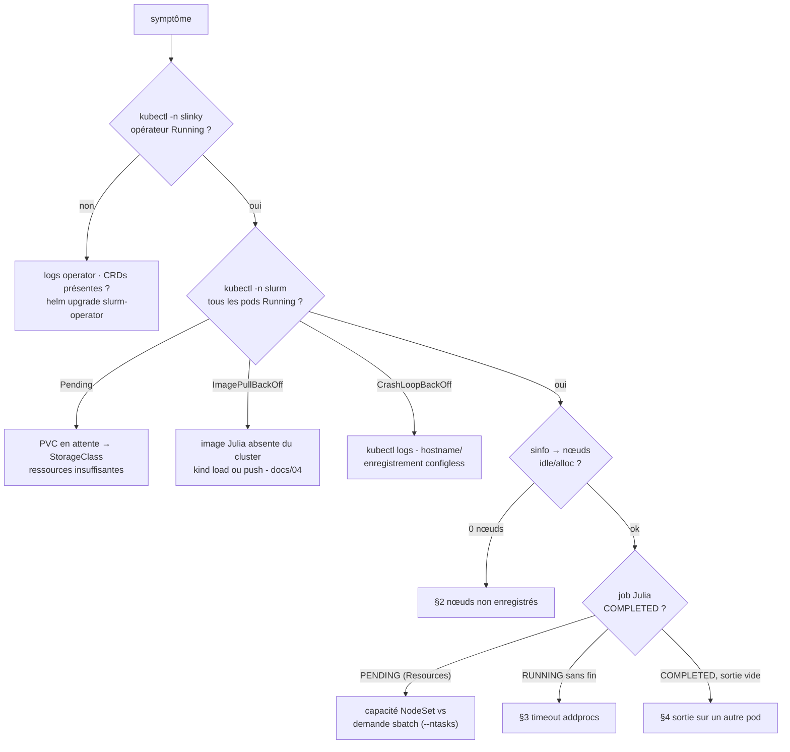
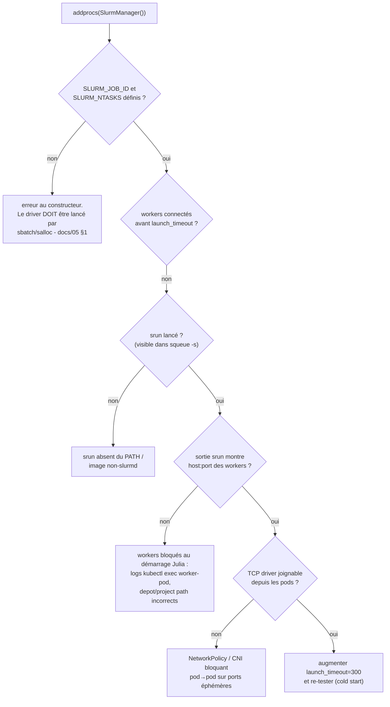

# 08 - Troubleshooting

← [07 - Exemples bout-en-bout](07-exemples-bout-en-bout.md) | [README →](../README.md)

## 1. Diagnostic général



Commandes de collecte (à joindre à toute demande d'aide) :

```bash
kubectl -n slinky get pods && kubectl -n slinky logs deploy/slurm-operator --tail=100
kubectl -n slurm get pods -o wide
kubectl -n slurm get controller,nodesets,loginsets -o yaml | head -200
LOGIN=$(kubectl get pods -n slurm -o name | grep -m1 login | cut -d/ -f2)
kubectl exec -n slurm "$LOGIN" -- sinfo && kubectl exec -n slurm "$LOGIN" -- squeue
```

## 2. `sinfo` ne montre aucun nœud

| Cause | Diagnostic | Correctif |
|---|---|---|
| pods slurmd pas prêts | `kubectl get pods -n slurm` | traiter les états ci-dessus d'abord |
| image Julia incompatible | `kubectl exec <worker> -- sinfo` échoue aussi | vérifier que l'image hérite bien de `slurmd:26.05-*` (userland Slurm requis) |
| enregistrement configless | `kubectl logs <worker>` : erreurs `slurmctld` DNS | vérifier le svc `slurm-controller` dans le namespace ; jamais de `SLURM_CONF` fixe à mettre |
| hostname mismatch | logs operator : `HostnameMismatch` | laisser l'opérateur recréer le pod (StatefulSet) ; l'annotation `NodeHostname` override existe pour les cas exotiques |

## 3. `addprocs` : erreurs et timeout



Erreurs typiques et significations :

| Message | Cause racine |
|---|---|
| `SlurmManager must be constructed inside a slurm allocation environment` | driver lancé hors allocation (REPL/pod libre) |
| `SLURM_NTASKS must be defined` | allocation sans `--ntasks` (ex. `salloc` sans ressources) |
| `Timeout on waiting for 16 workers to start` | callback TCP bloqué ou workers morts - arbre ci-dessus |
| `Job step aborted: Waiting up to 32 seconds` | exit sans `rmprocs` - cosmétique, diminuer avec `srun_post_exit_sleep` |

## 4. Sortie de job introuvable / vide

- La sortie vit sur **le pod de calcul qui a exécuté la tâche 0** - pas sur le
  pod de login. `scontrol show job <ID> | grep Node` donne le bon pod
  (traduire le `NodeList` Slurm en nom de pod : `worker-0` etc.).
- `--chdir` doit exister dans le conteneur (les exemples utilisent `/tmp`).
- Si le pod a redémarré entre-temps, le fichier est perdu (FS éphémère) :
  pour les jobs longs, montez un volume sur les NodeSets
  (`slurmd.volumeMounts`) et pointez `--output` dessus.

## 5. Authentification

| Symptôme | Correctif |
|---|---|
| `error: authentication: ... slurm.key` entre pods | secrets recréés d'un côté : `helm upgrade` réharmonise tout le cluster ; ne jamais remplacer un Secret manuellement sans re-roll des pods |
| REST : `401/403` slurmrestd | JWT expiré → `scontrol token username=root lifespan=86400` ; vérifier le header `X-SLURM-USER-TOKEN` |
| `sbatch: error: Invalid partition` | partition `all` absente → `partitions.all.enabled: true` dans les values |

## 6. kind (démo locale)

| Symptôme | Correctif |
|---|---|
| `kubeVersion` rejetée par helm | image `kindest/node` ≥ 1.29 dans `k8s/10-kind-config.yaml` |
| image absente après build | `kind load docker-image julia-slurmd:26.05-julia1.12 --name julia-slurm` |
| LoadBalancer login en `<pending>` | normal en kind : utiliser `kubectl exec`, pas SSH |
| PVC slurmctld en Pending | kind fournit `standard` (local-path) ; ne pas définir d'autre StorageClass en démo |

## 7. Performance des workers

- **Premier job lent** → depot non précompilé dans l'image (docs/04 §2) ou
  `JULIA_DEPOT_PATH` pointant hors image (recompilation à chaque pod).
- **Workers redondants sur le même CPU** → `--cpus-per-task` à l'allocation +
  `exeflags="--threads=$(ncores)"` plutôt que plus de tâches que de cœurs.
- **GC agressif sur gros objets** → volumes RWX pour les données, garder le
  depot image-local en lecture seule.

## 8. Réinitialisation complète

```bash
helm uninstall slurm -n slurm && kubectl delete ns slurm
helm uninstall slurm-operator -n slinky && kubectl delete ns slinky
# CRDs (si installées via slurm-operator-crds) :
kubectl delete crds $(kubectl get crds -o name | grep slinky.slurm.net | cut -d/ -f2)
./scripts/01-kind-cluster.sh down   # si kind
```

→ Retour : [README](../README.md)
