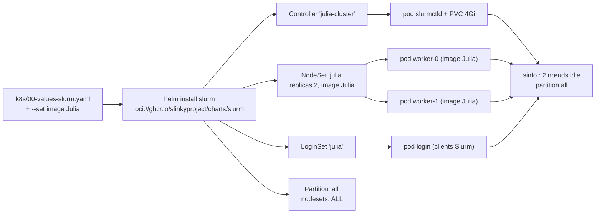
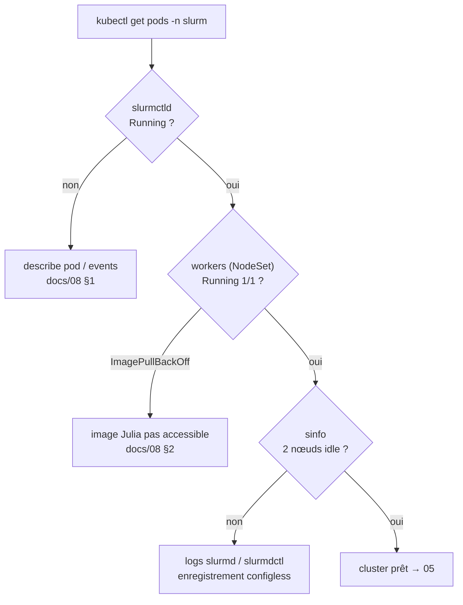

# 03 - Déploiement du cluster Slurm

← [02 - Prérequis](02-prerequis-installation.md) | [04 - Images conteneurs →](04-images-conteneurs.md)

## 1. Le chart `slurm` en un schéma

Une seule release Helm (`slurm`, namespace `slurm`) rend les Custom Resources
à partir de `k8s/00-values-slurm.yaml` ; l'opérateur fait le reste.



## 2. Values - les blocs qui comptent

Source : [`k8s/00-values-slurm.yaml`](https://github.com/deep75/julia-slurm-k8s/blob/main/k8s/00-values-slurm.yaml) (calqué sur
`helm/slurm/values.yaml` v1.3.0-rc1).

| Bloc | Clés utilisées | Effet |
|---|---|---|
| `clusterName` | `julia-cluster` | nom logique du cluster Slurm |
| `controller.slurmctld` | `image`, `resources` | pod ordonnanceur |
| `controller.persistence` | `enabled: true` | état slurmctld sur PVC |
| `loginsets.julia` | `enabled`, `replicas` | pods clients `sbatch`/`srun` |
| `nodesetDefaults` | `scalingMode: StatefulSet`, `workloadDisruptionProtection` | noms de pods stables + PDB pendant les jobs |
| `nodesets.julia` | `replicas: 2`, `slurmd.image.*`, `resources` | pods de calcul **avec image Julia** |
| `partitions.all` | `enabled`, `nodesets: [ALL]` | partition unique par défaut |

Subtilités :

- `nodesets` et `loginsets` sont des **maps nommées** : la clé (`julia`) sert
  aux chemins `--set` (`nodesets.julia.slurmd.image.repository`) et au motif
  de découverte des pods dans `scripts/lib/common.sh` (`WORKER_MATCH=julia`).
- `rootSshAuthorizedKeys` reste vide par défaut : l'accès se fait par
  `kubectl exec` (les scripts). Renseignez-le pour un accès SSH via le
  service LoadBalancer du LoginSet.
- Les secrets `slurm.key` / `jwt.key` sont générés par le chart
  (`slurmKey.create: true`) - pas de MUNGE à gérer.

## 3. Déploiement

```bash
./scripts/04-deploy-slurm.sh
# équivalent :
helm upgrade --install slurm \
  oci://ghcr.io/slinkyproject/charts/slurm \
  --namespace slurm --create-namespace \
  -f k8s/00-values-slurm.yaml \
  --set nodesets.julia.slurmd.image.repository="${JULIA_IMAGE_REPO}" \
  --set nodesets.julia.slurmd.image.tag="${JULIA_IMAGE_TAG}"
```

Le script attend ensuite `sinfo` depuis le pod de login (timeout
`WAIT_TIMEOUT=600s` par défaut).

## 4. Vérifications



```bash
kubectl get controller,nodesets,loginsets -n slurm
kubectl get pods -n slurm -o wide
LOGIN=$(kubectl get pods -n slurm -o name | grep -m1 login | cut -d/ -f2)
kubectl exec -n slurm "$LOGIN" -- sinfo
kubectl exec -n slurm "$LOGIN" -- scontrol show partition all
```

## 5. Variantes courantes

| Besoin | Changement (values ou --set) |
|---|---|
| plus de nœuds de calcul | `nodesets.julia.replicas: 4` |
| un pod slurmd par nœud K8s | `nodesetDefaults.scalingMode: DaemonSet` |
| accounting | bloc `accounting.enabled: true` (déploie slurmdbd) |
| REST API | bloc `restapi.enabled: true` (déploie slurmrestd :6820) |
| métriques | `controller.metrics.enabled=true` (+ Prometheus, doc 02) |
| StorageClass spécifique | `controller.persistence.storageClassName` |

Désinstallation propre :

```bash
helm uninstall slurm -n slurm
kubectl delete namespace slurm     # supprime PVC/Secrets résiduels
```

→ Suivant : [04 - Images conteneurs](04-images-conteneurs.md)
