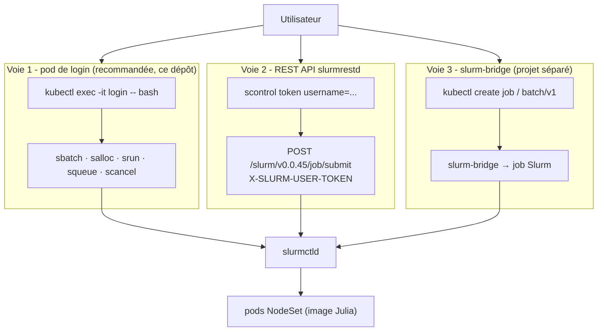
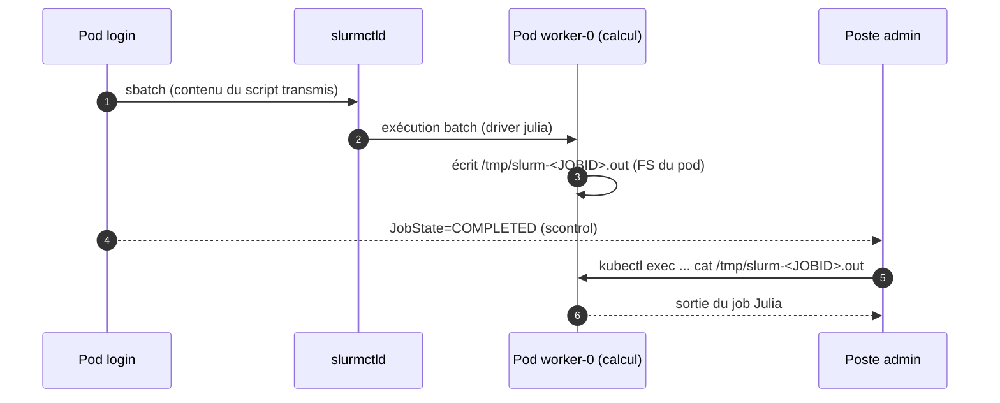

# 06 - Soumission de jobs

← [05 - Julia Distributed sur Slurm](05-julia-distributed-slurm.md) | [07 - Exemples bout-en-bout →](07-exemples-bout-en-bout.md)

## 1. Les trois voies de soumission



| Voie | Avantages | Limites |
|---|---|---|
| Pod de login | CLI Slurm complète, interactif, zéro config additionnelle | accès cluster requis (`kubectl exec` ou SSH) |
| REST API | intégration programmes/CI, JSON | JWT à renouveler, pas de `--pty` |
| slurm-bridge | jobs depuis l'écosystème K8s natif | projet séparé à installer, cas d'usage batch K8s |

## 2. Voie 1 : pod de login (utilisée par les scripts)

Deux accès possibles au même pod :

```bash
# A) kubectl exec - par défaut dans ce dépôt (aucune clé SSH)
LOGIN=$(kubectl get pods -n slurm -o name | grep -m1 login | cut -d/ -f2)
kubectl exec -it -n slurm "$LOGIN" -- bash

# B) SSH - si rootSshAuthorizedKeys est renseigné dans les values
SLURM_LOGIN_IP="$(kubectl get svc -n slurm slurm-login-julia \
  -o jsonpath='{.status.loadBalancer.ingress[0].ip}')"
ssh -p 22 root@"$SLURM_LOGIN_IP"
```

Puis, depuis le pod de login :

```bash
sinfo                                        # 2 nœuds idle (partition all)
salloc -N 2 --ntasks=16 bash                 # allocation interactive
julia --project=/opt/julia-examples          # REPL dans l'allocation
exit                                         # libère l'allocation

sbatch /tmp/hello.sbatch                     # batch (fichier copié par kubectl cp)
squeue -j <JOBID>
scontrol show job <JOBID> | grep JobState
scancel <JOBID>
```

> **Pourquoi `kubectl cp` le script sbatch ?** Le pod de login utilise l'image
> `login` officielle (sans Julia) ; le script sbatch n'a pas besoin d'être
> présent sur les pods de calcul - `sbatch` transmet son **contenu** au
> contrôleur, qui le rejoue sur le nœud alloué.

### Récupérer la sortie d'un job batch

Piège majeur du modèle sans FS partagé : `--output=/tmp/slurm-%j.out` est
écrit **sur le pod de calcul** qui a exécuté le job.



```bash
WORKER=$(kubectl get pods -n slurm -o name | cut -d/ -f2 | grep julia | head -1)
kubectl exec -n slurm "$WORKER" -- cat /tmp/slurm-<JOBID>.out
```

Le script [`scripts/05-run-julia-demo.sh`](https://github.com/deep75/julia-slurm-k8s/blob/main/scripts/05-run-julia-demo.sh)
automatise tout ce cycle (cp → sbatch --parsable → polling JobState → cat).

En interactif (`salloc`/`srun` attaché), la sortie revient en continu dans le
terminal - aucune récupération nécessaire.

## 3. Voie 2 : REST API (slurmrestd)

Prérequis : `restapi.enabled: true` dans les values du chart slurm.

```bash
# 1) jeton JWT (depuis le pod de login)
kubectl exec -n slurm "$LOGIN" -- scontrol token username=root lifespan=86400
export SLURM_JWT="eyJ..."   # valeur du champ token

# 2) endpoint (service slurm-restapi, port 6820)
kubectl -n slurm port-forward svc/slurm-restapi 6820:6820 &

# 3) soumission
curl -sS -k -H "X-SLURM-USER-TOKEN: $SLURM_JWT" \
     -H "Content-Type: application/json" \
     -X POST "http://localhost:6820/slurm/v0.0.45/job/submit" -d '{
  "job": {
    "name": "julia-pi",
    "partition": "all",
    "current_working_directory": "/tmp",
    "nodes": 2,
    "tasks": 16
  },
  "script": "#!/bin/bash\njulia --project=/opt/julia-examples /opt/julia-examples/02_monte_carlo_pi.jl\n"
}'
```

## 4. Voie 3 : slurm-bridge (batch/v1 Kubernetes)

[slurm-bridge](https://github.com/SlinkyProject/slurm-bridge) expose Slurm
comme interface batch Kubernetes : un `Job` K8s devient un job Slurm.

```bash
# jeton + secret (depuis le pod de login)
export SLURM_JWT=$(kubectl exec -n slurm "$LOGIN" -- scontrol token username=slurm lifespan=infinite | awk '{print $2}')
kubectl create secret generic slurm-bridge-jwt-token --namespace slurm \
  --from-literal="auth-token=$SLURM_JWT" --type=Opaque

helm install slurm-bridge oci://ghcr.io/slinkyproject/charts/slurm-bridge \
  --namespace slurm
# puis : kubectl create job julia-demo --image=<image-avec-clients-slurm> -- ...
```

> NB : le pod créé par slurm-bridge exécute le job Slurm côté client ; pour
> les jobs Julia multi-tâches avec `SlurmManager`, la **voie 1** (login +
> sbatch) reste la plus directe.

## 5. Cycle de vie et bonnes pratiques

| Action | Commande |
|---|---|
| état du cluster | `sinfo`, `scontrol show nodes` |
| file d'attente | `squeue -l` |
| détails d'un job | `scontrol show job <ID>` |
| annulation | `scancel <ID>` |
| limites par job | `--time`, `--mem`, `--cpus-per-task` (côté sbatch uniquement) |

- Les durées (`--time`) protègent le cluster : un driver Julia bloqué dans un
  `addprocs` sans timeout occupe l'allocation jusqu'à `MaxTime`.
- Les PDB (`workloadDisruptionProtection: true`) empêchent l'éviction des
  pods pendant les jobs - le scale-down attend la fin des jobs.

→ Suivant : [07 - Exemples bout-en-bout](07-exemples-bout-en-bout.md)
