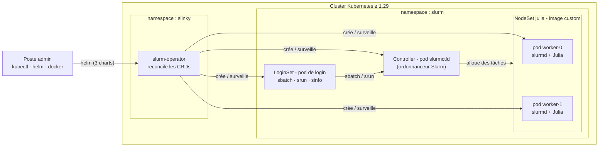

# Julia + Slurm sur Kubernetes — Slinky × SlurmClusterManager.jl

| **Documentation** | **Build Status** |
|:-----------------:|:----------------:|
|  |   |

Dépôt de référence pour faire tourner des charges **Julia `Distributed`** sur un cluster
**Slurm** entièrement orchestré dans **Kubernetes** par l'opérateur
[SlinkyProject/slurm-operator](https://github.com/SlinkyProject/slurm-operator)
(projet SchedMD / NVIDIA), avec
[JuliaParallel/SlurmClusterManager.jl](https://github.com/JuliaParallel/SlurmClusterManager.jl).

!!! note "Tout est théorique et livré prêt à l'emploi"
    Scripts bash, manifests Helm, exemples Julia, image conteneur. Aucune commande de ce
    dépôt n'est exécutée automatiquement — chaque étape est déclenchée par vous, sur
    votre cluster.

## Vue d'ensemble

Le driver Julia tourne **comme tâche 0 d'un job Slurm** (dans un pod `slurmd`), puis
`addprocs(SlurmManager())` lance un step `srun` qui démarre les workers Julia sur les autres
tâches. Les workers se reconnectent au driver en **TCP** grâce au DNS des pods (headless
service Slinky).

## Documentation

| Chapitre | Contenu |
|---|---|
| [01 — Architecture](01-architecture.md) | Composants Slinky, CRDs, réseau, modèle d'exécution Julia |
| [02 — Prérequis & installation](02-prerequis-installation.md) | Outils, versions, cert-manager, Kubernetes ≥ 1.29 |
| [03 — Déploiement du cluster Slurm](03-deploiement-slurm.md) | Chart `slurm`, values, vérifications |
| [04 — Images conteneurs](04-images-conteneurs.md) | Images officielles, image Julia custom, distribution |
| [05 — Julia Distributed sur Slurm](05-julia-distributed-slurm.md) | Contrat de `SlurmManager()`, flux interne, bonnes pratiques |
| [06 — Soumission de jobs](06-soumission-jobs.md) | sbatch/srun via pod de login, API REST, slurm-bridge |
| [07 — Exemples bout-en-bout](07-exemples-bout-en-bout.md) | Les 4 exemples pas à pas, sorties attendues |
| [08 — Troubleshooting](08-troubleshooting.md) | Arbres de diagnostic, erreurs courantes, correctifs |

## Contenu du dépôt

| Chemin | Rôle |
|---|---|
| [`scripts/`](https://github.com/deep75/julia-slurm-k8s/tree/main/scripts) | Pipeline bash numéroté : prérequis → operator → image → cluster → démo |
| [`k8s/`](https://github.com/deep75/julia-slurm-k8s/tree/main/k8s) | Values Helm du cluster Slurm + config kind de démo |
| [`docker/julia-slurm/`](https://github.com/deep75/julia-slurm-k8s/tree/main/docker/julia-slurm) | Dockerfile : image `slurmd` + Julia + depot précompilé |
| [`julia/`](https://github.com/deep75/julia-slurm-k8s/tree/main/julia) | Projet Julia (`Project.toml`) + 4 exemples + scripts `sbatch` |

## Versions de référence (état vérifié août 2026)

| Composant | Version | Note |
|---|---|---|
| slurm-operator (charts) | `1.3.0-rc1` | CRDs `slinky.slurm.net/v1beta1` |
| Slurm (images) | `26.05-ubuntu26.04` | `ghcr.io/slinkyproject/*` |
| Kubernetes | ≥ 1.29 | exigence du chart `slurm` |
| SlurmClusterManager.jl | `1.1.0` | validé avec Julia **1.12.7** |
| Julia | 1.10 – 1.12 | compat `julia/Project.toml` : `julia = "1.10"` |

## Points d'attention (résumé express)

1. **Pas de CRD `SlurmCluster`** : Slinky décompose en `Controller`, `NodeSet`, `LoginSet`,
   `Accounting`, `RestAPI`, `Token`.
2. **Pas de MUNGE** : authentification `auth/slurm` (clé partagée `slurm.key`).
3. **`SlurmManager()` n'accepte aucun argument Slurm** — le driver Julia doit déjà être
   **dans une allocation** (`SLURM_JOB_ID` + `SLURM_NTASKS` requis).
4. **Pas de FS partagé par défaut** : le code/données Julia passent par l'image ; la sortie
   sbatch vit sur le pod de calcul (récupération `kubectl exec`).
5. Le callback TCP workers → driver fonctionne car les noms de pods sont résolus via le
   **headless service** `slurm-workers-<controller>`.
